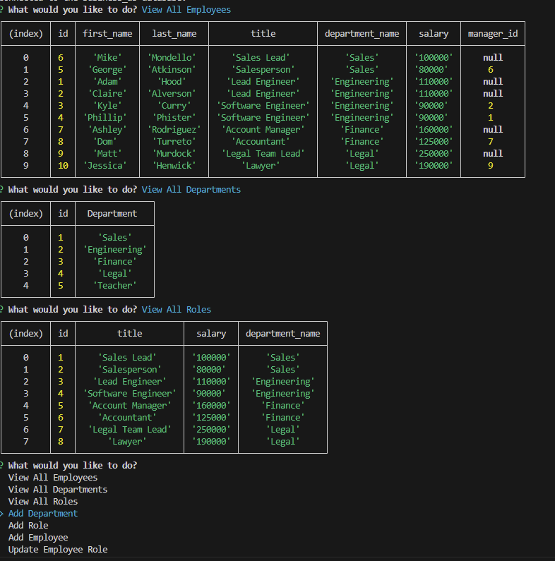

# Employee-Tracker
  
  ## Description
  The Employee Tracker application displays a sql database in the command line that a user can answer questions to directly through the CLI. The purpose in creating this application is build an easy to use interface for non developers to use and interact with their business.

  

  ## Table of Contents
  * [Installation](#installation)

  * [Usage](#usage)

  * [License](#license)

  * [Contributing](#contributing)

  * [Questions](#questions)

  * [Credits](#credits)

  

  ## Installation
  Clone the repository onto your local machine. Open the file in your preferred code editor. Open an integrated terminal for the index.js file. 
  
  To install dependencies, run the following command in the command line: npm i.
  
  ## Usage
  Once you clone the repo and install the dependencies you will type in: node index to the command line which will start up the application. Simply select a prompt to display the specified data or edit the data according to the prompts.

  Below is a screenshot of the application operating in VSCode.

  

  Usage Link: https://drive.google.com/file/d/1BDb7E-NURRQ5_vzvKqrkLgDbijfEr1Pg/view
  
  
  ## License
  Notice: This application is covered under the  license.

  ## Contributing
  At this time there are no plans to include contributions to this project. 
  
  ## Questions
  Please reach out to me below if you have any questions.

  
  GitHub: [adamhood15](https://github.com/adamhood15)

  Email: adamhood15@gmail.com
  
  ## Credits
  I am the sole collaborator on this project. Rice University provided the starter code. 